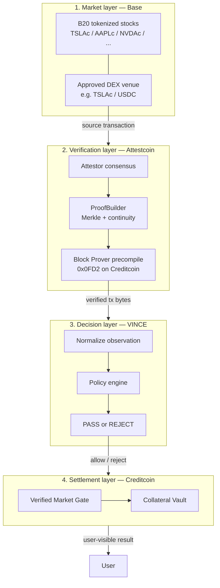
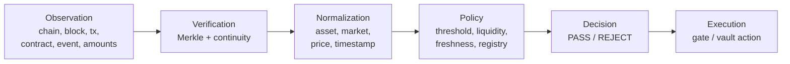
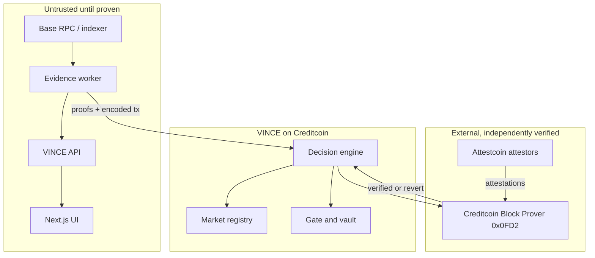

# VINCE Architecture

Status: Draft  
Audience: protocol engineers, reviewers, coding agents

This document is the system map. Detailed subsystem specs live under `docs/`. Open decisions live in `DECISIONS.md`.

## One sentence

VINCE is a cross-chain collateral and trading gate that uses verifiable source-chain tokenized-stock market activity to make deterministic financial decisions on Creditcoin, without trusting a centralized price-reporting API.

## Four layers

VINCE is not one contract. It is four layers with different trust properties.

```text
1. MARKET LAYER        Base tokenized stocks + DEX
2. VERIFICATION LAYER  Attestcoin proves source-chain transactions
3. DECISION LAYER      VINCE interprets the verified observation
4. SETTLEMENT LAYER    Creditcoin smart contracts enforce the decision
```



## Core law

No financial action on Creditcoin may depend solely on an off-chain assertion about a source-chain market observation. The action must be derived from verifiable source-chain evidence and pass the protocol's explicit policy rules.

## What each layer is allowed to claim

| Layer | May claim | May not claim |
| --- | --- | --- |
| Market | A swap, mint, or transfer happened in a Base contract | That VINCE should lend, unlock, or liquidate |
| Verification | This transaction was included in an attested source-chain block | That TSLAc is worth `$250`, or that policy passed |
| Decision | The verified observation satisfies or fails VINCE rules | That the proof is valid if the precompile did not say so |
| Settlement | Execute `ALLOW`, `REJECT`, `LOCK`, `UNLOCK`, `BORROW`, `LIQUIDATE` | Trust a backend JSON payload as market truth |

## Decision pipeline

Do not collapse this pipeline into the vault.

```text
OBSERVATION
     ↓
VERIFICATION
     ↓
NORMALIZATION
     ↓
POLICY
     ↓
DECISION
     ↓
EXECUTION
```



| Stage | Input | Output | Owner |
| --- | --- | --- | --- |
| Observation | Base logs, receipts, pool state | Raw evidence package | Evidence worker |
| Verification | Encoded tx + Merkle proof + continuity proof | Boolean inclusion + verified tx bytes | Attestcoin precompile |
| Normalization | Verified tx bytes | Canonical `MarketObservation` | VINCE contracts |
| Policy | Observation + registry config | Rule results | VINCE policy engine |
| Decision | Rule results | `PASS` or `REJECT` plus reason codes | VINCE decision engine |
| Execution | Decision + requested action | State change or revert | Gate / vault |

## Trust boundary



The worker, API, and UI may **prepare** evidence. They may not **authorize** a financial action.

## Intended MVP: Verified Market Gate

Do not start with a lending protocol.

```text
User selects TSLAc
        ↓
Market condition: TSLAc ≥ $250
        ↓
Find eligible Base transaction
        ↓
Wait for source-block attestation
        ↓
Generate Merkle + continuity proof
        ↓
Verify on Creditcoin
        ↓
Normalize and evaluate policy
        ↓
PASS → Continue
REJECT → Stop, with reason
```

The vault is Phase 6. It reuses the same decision engine. See [docs/04-DEVELOPMENT-SEQUENCE.md](./docs/04-DEVELOPMENT-SEQUENCE.md).

## Project hierarchy

```text
VINCE
│
├── SOURCE
│   └── Base
│       ├── Tokenized Stocks (B20, issuer-controlled)
│       └── DEX (approved venue — OPEN)
│
├── PROOF
│   └── Attestcoin readability
│       ├── Attestors
│       ├── ProofBuilder
│       └── Block Prover precompile
│
├── DECISION
│   ├── Market Registry
│   ├── Observation Engine
│   ├── Policy Engine
│   └── Risk Rules
│
├── SETTLEMENT
│   └── Creditcoin
│       ├── Verified Market Gate
│       └── Vault (after the gate works)
│
├── APPLICATION
│   ├── Evidence worker
│   ├── API
│   └── Next.js UI
│
└── ENGINEERING
    ├── ADRs
    ├── Observability
    ├── Security
    ├── Testing
    └── Agent rules
```

## Documented facts vs open design

Architecture must not invent capabilities. These are currently **facts from official docs**:

- Coinbase tokenized stocks on Base are B20 tokens, identified by address, not ticker.
- TSLAc address: `0xb2000000000000000000001e800a7f5189430cD0`.
- Base Chainlink equity feeds report traditional-market total-return values. They are **not** DEX prices.
- Attestcoin readability proves transaction inclusion with a Merkle proof and a continuity proof.
- Creditcoin verifies those proofs at precompile `0x0000000000000000000000000000000000000FD2`.
- The precompile does **not** prove the transaction succeeded. VINCE must check receipt status `0x1`.
- Official Attestcoin environment tables currently list Ethereum Mainnet and Ethereum Sepolia as supported source chains.

Closed models:

1. **MVP source:** Ethereum (CC3 Testnet `chainKey` 3 for Ethereum Mainnet, `1` for Sepolia smoke). Base TSLAc is later, never faked ([ADR-005](./docs/decisions/ADR-005-source-chain-feasibility.md)).
2. **Price:** Chainlink feed-update, 8 decimals, user **pastes** the tx ([ADR-003](./docs/decisions/ADR-003-price-observation-model.md), [ADR-010](./docs/decisions/ADR-010-user-pastes-tx.md)).
3. **Vault:** 30-minute PASS window, 50% LTV, mock vUSD ([ADR-004](./docs/decisions/ADR-004-vault-decision-model.md)).

Still blank until sourced:

- Proof Builder URL that works
- Ethereum TSLA/USD proxy + aggregator + event from Chainlink
- Empirical `getSupportedChains()` dump

## Application surface

The protocol is chain logic. The product is a simple gate.

| Concern | Choice | Detail |
| --- | --- | --- |
| Web app | Next.js + TypeScript + Tailwind | [docs/application/frontend.md](./docs/application/frontend.md) |
| Type | Inter + Poppins | Body / display |
| Color | Black + blue | No decorative palettes |
| Contracts | Solidity + Hardhat | [docs/integration/creditcoin.md](./docs/integration/creditcoin.md) |
| Proofs | `@gluwa/usc-sdk` | `ProofBuilder`, `PrecompileChainInfoProvider`, `PrecompileBlockProver` |

Users should see:

```text
Paste tx           0x…
TSLA/USD           Ethereum
Official feed      $263.40
Required           ≥ $250
✓ Verified on Ethereum
✓ Cross-chain proof verified
✓ Market condition satisfied
[Continue]
```

They should not have to understand Merkle trees. Cryptographic detail belongs in an advanced panel.

## Related documents

- Problem: [docs/00-PROBLEM.md](./docs/00-PROBLEM.md)
- Vision: [docs/01-VISION.md](./docs/01-VISION.md)
- Expanded architecture: [docs/02-SYSTEM-ARCHITECTURE.md](./docs/02-SYSTEM-ARCHITECTURE.md)
- Parties: [docs/03-ECOSYSTEM.md](./docs/03-ECOSYSTEM.md)
- Threats: [THREAT-MODEL.md](./THREAT-MODEL.md)
