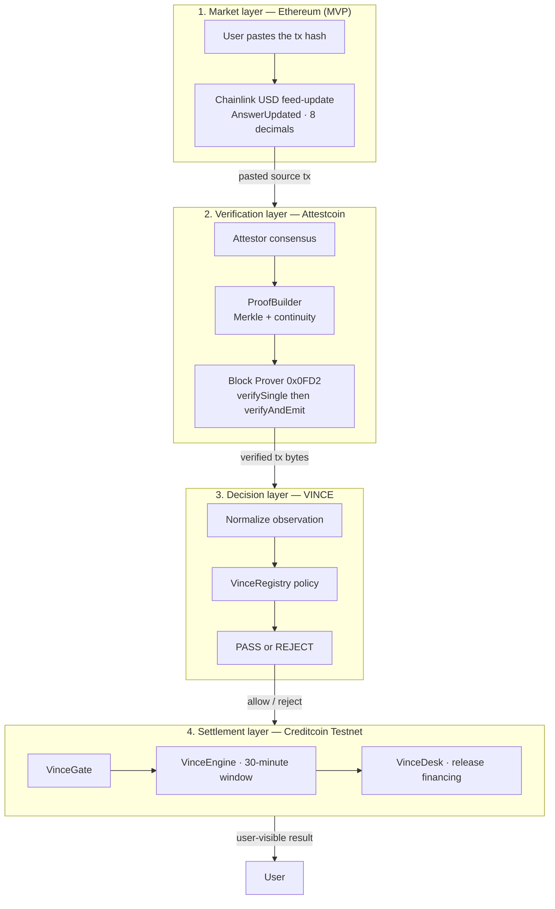
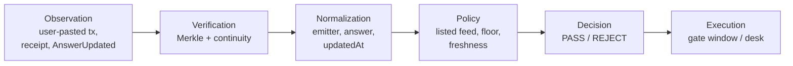
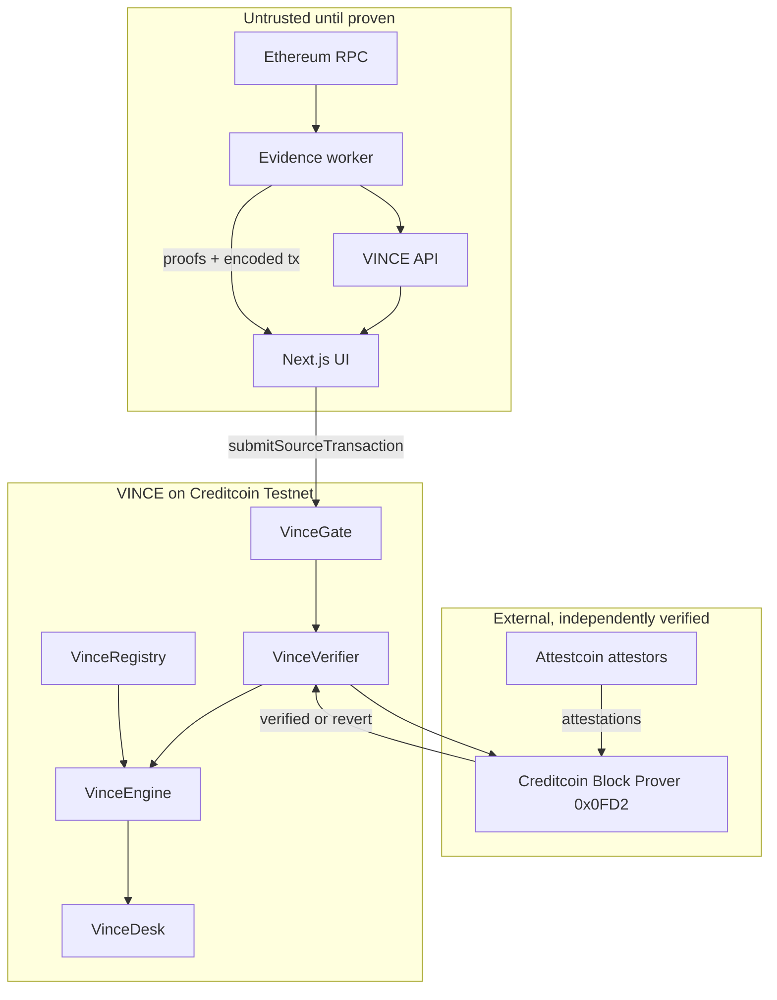

# VINCE Architecture

Status: Live on Creditcoin Testnet (ADR-014)  
Audience: protocol engineers, reviewers, coding agents, hackathon judges

This document is the system map. Detailed subsystem specs live under `docs/`. Open decisions live in `DECISIONS.md`.

## One sentence

VINCE is a verified market gate: a user pastes an Ethereum feed-update, Attestcoin proves inclusion on Creditcoin, VINCE scores that **listed** market’s rule, and a Creditcoin desk may act only after `PASS`. Proof ≠ PASS.

## Four layers

VINCE is not one contract. It is four layers with different trust properties.

```text
1. MARKET LAYER        Ethereum Chainlink feed-updates (MVP). Base B20 later.
2. VERIFICATION LAYER  Attestcoin proves source-chain transaction inclusion
3. DECISION LAYER      VINCE interprets the verified observation
4. SETTLEMENT LAYER    Creditcoin contracts enforce the decision
```



Base tokenized stocks (TSLAc, …) are a **later** market layer, only after `getSupportedChains()` lists Base ([ADR-005](./docs/decisions/ADR-005-source-chain-feasibility.md)). Never label an Ethereum proof as TSLAc.

The vault is lab-only ([ADR-013](./docs/decisions/ADR-013-gate-is-the-product.md)). It may deploy. It is not the product.

## Core law

No financial action on Creditcoin may depend solely on an off-chain assertion about a source-chain market observation. The action must be derived from verifiable source-chain evidence and pass the protocol's explicit policy rules.

## What each layer is allowed to claim

| Layer | May claim | May not claim |
| --- | --- | --- |
| Market | A Chainlink `AnswerUpdated` happened on Ethereum | That VINCE should PASS, or that TSLAc traded |
| Verification | This transaction was included in an attested source-chain block | That the print is the listed market, or that policy passed |
| Decision | The verified observation satisfies or fails VINCE rules | That the proof is valid if the precompile did not say so |
| Settlement | Execute `PASS` window / `REJECT` / desk `releaseFinancing` | Trust a backend JSON payload or `eth_call` as market truth |

## Decision pipeline

Do not collapse this pipeline into the desk.

```text
OBSERVATION
     ↓
VERIFICATION
     ↓
NORMALIZATION
     ↓
POLICY
     ↓
DECISION
     ↓
EXECUTION
```



| Stage | Input | Output | Owner |
| --- | --- | --- | --- |
| Observation | Pasted Ethereum tx | Raw evidence package | Evidence worker (`POST /api/observe`) |
| Verification (view) | Encoded tx + Merkle + continuity | `verifySingle` boolean | Attestcoin `0x0FD2` (no CTC) |
| Verification (settlement) | Same proofs | `verifyAndEmit` + receipt `0x1` | `VinceVerifier` on Creditcoin (CTC) |
| Normalization | Verified tx bytes | Canonical observation (emitter, answer, `updatedAt`) | `VinceEngine` |
| Policy | Observation + `VinceRegistry` | Rule results | `VinceEngine` |
| Decision | Rule results | `PASS` or `REJECT` plus reason codes | `VinceEngine` |
| Execution | Live PASS window | `VinceDesk.releaseFinancing` | Desk |

## Trust boundary



The worker, API, and UI may **prepare** evidence. They may not **authorize** a financial action. Submit is disabled unless `verifySingle === true`. On-chain submit still re-checks `0x0FD2`.

## Live MVP: Verified Market Gate + desk

```text
User copies an Ethereum Chainlink feed-update hash
        ↓
Pastes it on /gate  (wallet not required yet)
        ↓
Worker: waitUntilHeightAttested → getProof → verifySingle
        ↓
Two verdicts: proof verified  ·  listed rule met or not
        ↓
Connect Creditcoin → VinceGate.submitSourceTransaction
        ↓
VinceVerifier.verifyAndEmit at 0x0FD2
        ↓
VinceEngine: listed emitter · floor · freshness
        ↓
PASS → 30-minute window → /desk may release financing
REJECT → desk stays locked
```

Unlisted emitter → `REJECT_FEED`. Paste does not write the registry. Live registry **starts empty**. Owner lists a sourced aggregator on `/markets`.

## Project hierarchy

```text
VINCE
│
├── SOURCE
│   └── Ethereum Mainnet (CC3 Testnet chainKey 3)
│       └── Chainlink USD feed-update (AnswerUpdated)
│   └── Base B20 — later, not MVP
│
├── PROOF
│   └── Attestcoin readability
│       ├── Attestors
│       ├── ProofBuilder  https://prover.cc3-testnet.creditcoin.network
│       └── Block Prover 0x0FD2
│
├── DECISION
│   ├── VinceRegistry
│   ├── VinceEngine
│   └── Risk rules (per listing)
│
├── SETTLEMENT
│   └── Creditcoin Testnet 102031
│       ├── VinceVerifier
│       ├── VinceGate
│       ├── VinceDesk
│       └── VinceVault (lab only, not in UI)
│
├── APPLICATION
│   ├── Evidence worker  POST /api/observe
│   └── Next.js UI  /gate /desk /markets /activity
│
└── ENGINEERING
    ├── ADRs
    ├── Observability
    ├── Security
    ├── Testing
    └── Agent rules
```

## Documented facts vs later markets

Architecture must not invent capabilities. These are **facts**:

- MVP source is Ethereum. CC3 Testnet `getSupportedChains()`: Ethereum `chainKey` 3 / `chainId` 1; Sepolia `chainKey` 1 / `chainId` 11155111. Base is absent.
- Working Proof Builder: `https://prover.cc3-testnet.creditcoin.network`.
- Attestcoin readability proves inclusion with a Merkle proof and a continuity proof at `0x0000000000000000000000000000000000000FD2`.
- The precompile does **not** prove success. VINCE requires receipt status `0x1`.
- MVP price is a registered Chainlink feed-update, 8 decimals. Identity is the log emitter, never the ticker.
- User **pastes** the source tx ([ADR-010](./docs/decisions/ADR-010-user-pastes-tx.md)). Worker must not swap the hash.
- Live settlement is Creditcoin Testnet ([ADR-014](./docs/decisions/ADR-014-creditcoin-settlement.md)). Sepolia does not host `0x0FD2`.
- Product is the gate + desk ([ADR-013](./docs/decisions/ADR-013-gate-is-the-product.md)).

Still blank until sourced:

- Ethereum TSLA/USD aggregator (do not invent it)
- Base `chainKey` (do not fake it)

Sourced, **not listed** unless the owner calls `listMarket`: BAT/USD aggregator `0x1c9049C48C24111A3546a73C67FD2A4Fc6C86Fdc` ([docs/protocol/market-registry.md](./docs/protocol/market-registry.md)).

## Application surface

| Concern | Choice | Detail |
| --- | --- | --- |
| Web app | Next.js + TypeScript + Tailwind | [docs/application/frontend.md](./docs/application/frontend.md) |
| Type | Inter + Poppins | Body / display |
| Color | Black + blue | No decorative palettes |
| Wallet | Injected `window.ethereum` | Creditcoin Testnet, CTC |
| Contracts | Solidity + Hardhat | Live addresses in [README.md](./README.md) |
| Proofs | `@gluwa/usc-sdk` | `ProofBuilder`, `PrecompileChainInfoProvider`, `PrecompileBlockProver` |

Users should see:

```text
Paste tx           0x…
Matched market     from the feed, after decode
Official feed      proven AnswerUpdated
Required           that listing’s floor  (or “not listed”)
✓ Verified on Ethereum
✓ Cross-chain proof verified
✓ Market condition satisfied   or REJECT_*
[ Submit on Creditcoin ]
[ Open the desk ]
```

They should not have to understand Merkle trees. Cryptographic detail belongs in an advanced panel.

## Related documents

- Problem: [docs/00-PROBLEM.md](./docs/00-PROBLEM.md)
- Vision: [docs/01-VISION.md](./docs/01-VISION.md)
- Expanded architecture: [docs/02-SYSTEM-ARCHITECTURE.md](./docs/02-SYSTEM-ARCHITECTURE.md)
- Parties: [docs/03-ECOSYSTEM.md](./docs/03-ECOSYSTEM.md)
- Threats: [THREAT-MODEL.md](./THREAT-MODEL.md)
- Live contracts: [README.md](./README.md)
