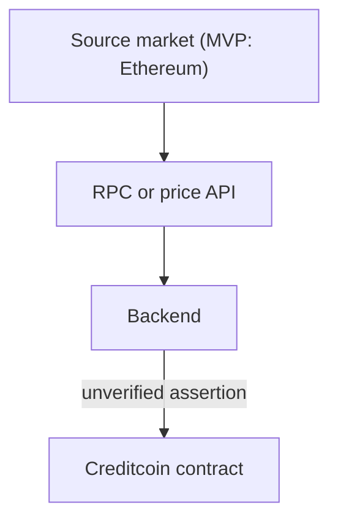

# 00 — Problem

## The one-line problem

How can a Creditcoin application make a financial decision based on an event that happened on another chain, while minimizing trust in an external reporter?

## Why this exists

A Creditcoin contract may need a fact such as:

> Did this listed Ethereum USD feed print at or above its floor?

The intended later question is tokenized-stock activity on Base (TSLAc). Attestcoin does not list Base today, so MVP proves an Ethereum Chainlink feed-update instead of inventing a Base proof ([ADR-005](./decisions/ADR-005-source-chain-feasibility.md)).

A naive architecture does this:

```text
Source chain
  ↓
RPC / API
  ↓
VINCE backend
  ↓
"price = 250"
  ↓
Creditcoin
```



In that design the Creditcoin contract is not independently establishing the fact. It is trusting an intermediary. If the backend lies, censors, or is compromised, settlement still proceeds.

That is the trust problem VINCE is built to reduce.

## What is not the problem

VINCE is not trying to invent a new tokenized stock. Coinbase-issued B20 tokens already exist on Base; they are a later listing.

VINCE is not trying to replace Attestcoin. Attestcoin already proves source-chain transaction inclusion on Creditcoin.

VINCE is not, in MVP, trying to be a full lending market. The desk is a later-shaped consumer of a verified decision. The vault is lab-only.

## What is the problem, precisely

There are two different questions, often confused:

1. **Cryptographic question:** Was this transaction included in an attested source-chain block?
2. **Economic question:** Does that verified observation satisfy VINCE's market policy?

A centralized API answers neither with Creditcoin as the judge.

Attestcoin answers (1).

VINCE must answer (2), on-chain, from verified bytes, against explicit rules.

## Failure of the naive design

| Failure | Result |
| --- | --- |
| Backend posts a fake price | Contract may ALLOW |
| Backend uses the wrong pool | Contract may ALLOW a manipulated print |
| Backend uses a stale print | Contract may ALLOW a condition that is gone |
| Backend is down | Contract has no independent way to decide |
| UI displays an API number | User believes Creditcoin verified it |

## Required property

A `PASS` on Creditcoin must be reconstructable from:

1. Source-chain transaction bytes
2. A Merkle proof of inclusion
3. A continuity proof to an Attestcoin attestation
4. Successful receipt status
5. VINCE policy rules applied to the decoded observation

If any of those are missing, the action must not succeed.

## Related

- Vision: [01-VISION.md](./01-VISION.md)
- Threats: [../THREAT-MODEL.md](../THREAT-MODEL.md)
- ADR-001: [decisions/ADR-001-cross-chain-verification.md](./decisions/ADR-001-cross-chain-verification.md)
