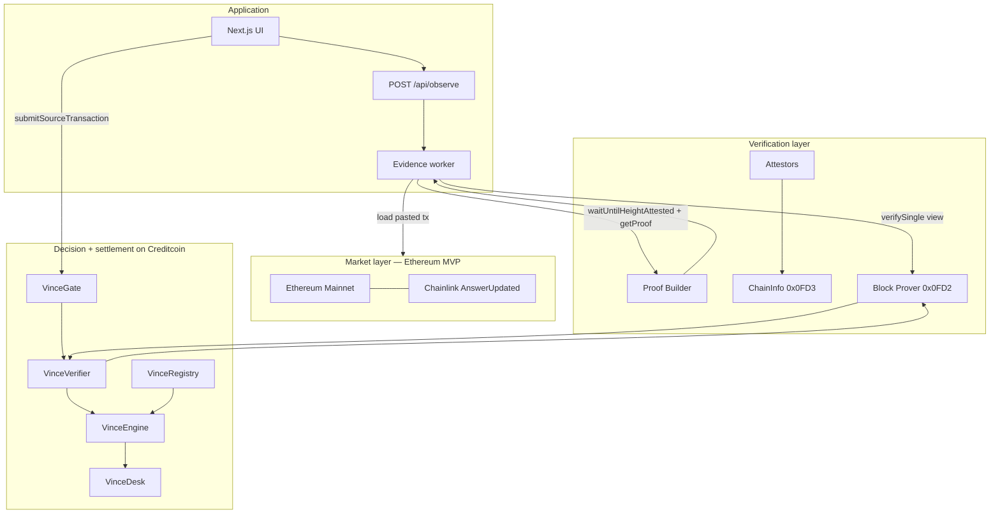
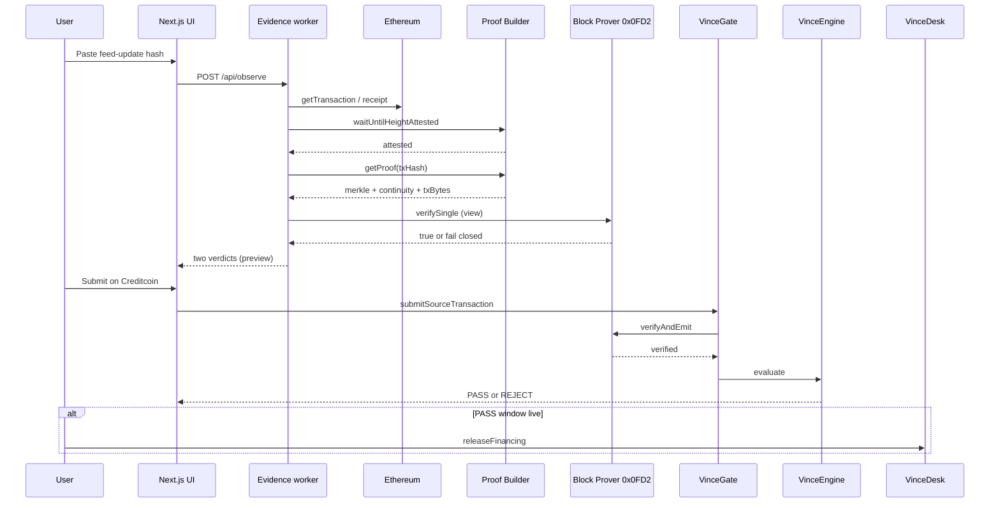

# 02 — System architecture

This expands [ARCHITECTURE.md](../ARCHITECTURE.md). If the two ever drift, the root file is the summary and this file is the working map.

Live settlement: Creditcoin Testnet `102031` ([ADR-014](./decisions/ADR-014-creditcoin-settlement.md)). MVP source: Ethereum (`chainKey` 3). Product: gate + desk ([ADR-013](./decisions/ADR-013-gate-is-the-product.md)).

## Layered system

Vault / mock vUSD may exist on-chain as lab contracts. They are not in this diagram because they are not the product.

## Component responsibilities

### Evidence worker

Off-chain (`web/src/lib/protocol/observe.ts`, `POST /api/observe`). May:

- accept a **user-pasted** tx hash (never swap it)
- load the Ethereum receipt
- wait for attestation
- request Merkle and continuity proofs
- call `verifySingle` as a fail-closed preview
- preview policy against `VinceRegistry` (labeled preview until on-chain submit)

Must not:

- be treated as an oracle
- have an admin function that writes a price
- skip verification on a "happy path"
- list a market as a side effect of paste

See [application/evidence-worker.md](./application/evidence-worker.md).

### VinceVerifier

On Creditcoin. Calls Block Prover `verifyAndEmit`, requires `true`, requires receipt `0x1`, records a replay key. This is an Attestcoin Smart Contract. It does not compute a price.

### VinceRegistry

On Creditcoin. Owner `listMarket` / `unlistMarket` / `pauseMarket`. Identity is `feedAggregator` (log emitter). Starts empty. Unlisted emitter → `REJECT_FEED`.

### VinceEngine

On Creditcoin. Decode `AnswerUpdated` from proven bytes, apply that listing’s floor and freshness, open a 30-minute PASS window.

### VinceGate

On Creditcoin. User-facing submit of Merkle + continuity + encoded tx. Only the gate may call `engine.evaluate`.

### VinceDesk

On Creditcoin. Hackathon consumer. `releaseFinancing()` requires `engine.inWindow()`. Emits `FinancingReleased`. Not a money market.

## Official Attestcoin flow VINCE follows

1. Query supported chains via `PrecompileChainInfoProvider`.
2. Resolve `chainKey`. This is not EVM `chainId`.
3. Load the **pasted** source transaction and its block number.
4. `waitUntilHeightAttested(chainKey, blockNumber)`.
5. `ProofBuilder.getProof(txHash)`.
6. Worker: `PrecompileBlockProver.verifySingle(...)`.
7. User: `VinceGate` → `VinceVerifier.verifyAndEmit` at `0x0FD2`.
8. Decode verified transaction bytes. Require receipt status success.
9. Apply VINCE policy.

## Combined vs separated contracts

Attestcoin documents two patterns:

- **Combined:** verification and business logic in one contract.
- **Separated:** ASC verifies, then calls business logic.

VINCE uses **separated**: `VinceVerifier` ≠ `VinceEngine` ≠ `VinceDesk`. See [contracts/architecture.md](./contracts/architecture.md).

## What VINCE will not put on Base (MVP)

VINCE does not modify B20 tokens. MVP does not observe Base at all. Ethereum Chainlink `AnswerUpdated` is the MVP observation class ([ADR-003](./decisions/ADR-003-price-observation-model.md), [ADR-006](./decisions/ADR-006-observation-event-model.md)).

Base TSLAc remains a later listing after Attestcoin lists Base.

## Environments

Creditcoin (official endpoints):

| Network | Chain ID | RPC | Explorer |
| --- | --- | --- | --- |
| Mainnet | 102030 | `https://mainnet3.creditcoin.network` | https://creditcoin.blockscout.com/ |
| Testnet | 102031 | `https://rpc.cc3-testnet.creditcoin.network` | https://creditcoin-testnet.blockscout.com/ |

Attestcoin precompiles (from Attestcoin environment docs):

| Precompile | Address |
| --- | --- |
| Block Prover | `0x0000000000000000000000000000000000000FD2` |
| ChainInfo | `0x0000000000000000000000000000000000000FD3` |

Working Proof Builder (Phase 2): `https://prover.cc3-testnet.creditcoin.network`.  
CC3 Testnet decoder: `0x731c345d79Fb8BbDC541f9DF3b6317585F849F9f`.

Live VINCE app addresses: [README.md](../README.md) and [`contracts/deployments/creditcoin-testnet.json`](../contracts/deployments/creditcoin-testnet.json).

## Related

- Ecosystem: [03-ECOSYSTEM.md](./03-ECOSYSTEM.md)
- Verification spec: [protocol/verification.md](./protocol/verification.md)
- Frontend: [application/frontend.md](./application/frontend.md)
