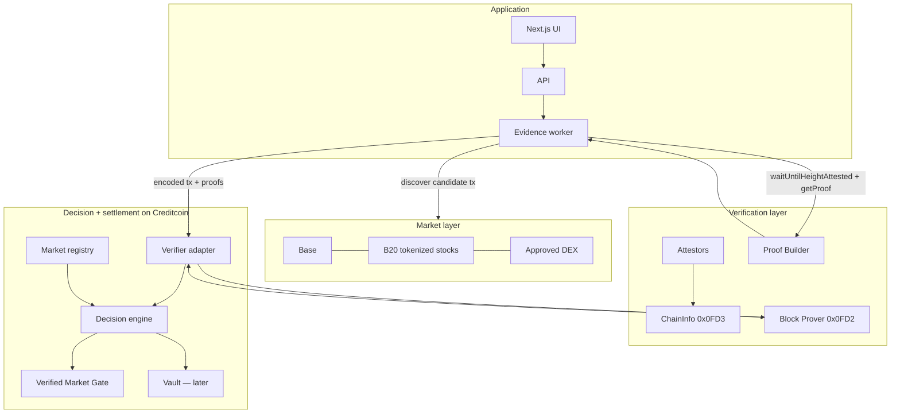
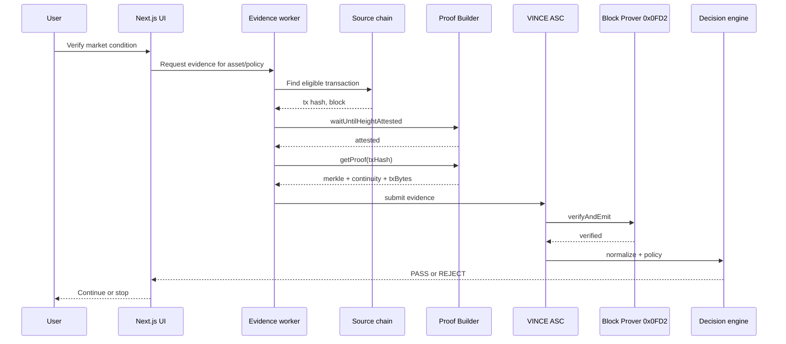

# 02 — System architecture

This expands [ARCHITECTURE.md](../ARCHITECTURE.md). If the two ever drift, the root file is the summary and this file is the working map.

## Layered system



## Component responsibilities

### Evidence worker

Off-chain. May:

- watch approved pools and assets
- select a candidate transaction
- wait for attestation
- request Merkle and continuity proofs
- submit proofs to VINCE contracts
- retry, log, and distinguish failure stages

Must not:

- be treated as an oracle
- have an admin function that writes a price
- skip verification on a "happy path"

See [application/evidence-worker.md](./application/evidence-worker.md).

### VINCE verifier adapter

On Creditcoin. Calls the Block Prover precompile, requires `true`, then hands verified bytes to normalization. This is an Attestcoin Smart Contract in Attestcoin vocabulary.

### Market registry

On Creditcoin. Stores approved `chainKey`, asset addresses, **feed** addresses, pool addresses, quote asset, thresholds, and freshness. Configuration, not observation. MVP price emitter is `feed`, not `pool`.

### Decision engine

On Creditcoin. Pure interpretation of verified observations against registry policy. Emits `PASS` / `REJECT` with reason codes.

### Verified Market Gate

On Creditcoin. MVP product surface. A user action continues only after a current `PASS` for the requested condition.

### Vault

On Creditcoin. Phase 6. Deposits, borrow limits, lock/unlock, later liquidation. It consumes decisions. It does not reimplement verification.

## Data objects

These are conceptual. Solidity shapes come after ADRs close.

### RawEvidence

```text
sourceChainKey
sourceChainId
blockNumber
txHash
txTo
poolAddress
assetAddress
quoteAddress
logs
timestamp
```

### InclusionProof

```text
chainKey
headerNumber
txBytes
merkleProof
continuityProof
```

Official SDK field names from Attestcoin docs: `chainKey`, `headerNumber`, `txHash`, `txBytes`, `merkleProof`, `continuityProof`, `cached`.

### MarketObservation

```text
asset            address
market           approved pool
quote            address
observedPrice    integer, documented scale
observedAt       source timestamp or block time
liquidity        if policy requires it
rawAmounts       decoded swap amounts
```

### PolicyConfig

```text
minimumPrice
minimumLiquidity
maxAgeSeconds
approvedPool
approvedAsset
approvedQuote
requiredEventSignature
```

### Decision

```text
status           PASS | REJECT
reasons[]        machine-readable codes
observationId
policyVersion
verifiedTxKey
```

## Official Attestcoin flow VINCE must follow

From Attestcoin SDK documentation:

1. Query supported chains via `PrecompileChainInfoProvider`.
2. Resolve `chainKey`. This is not EVM `chainId`.
3. Load the source transaction and its block number.
4. `waitUntilHeightAttested(chainKey, blockNumber)`.
5. `ProofBuilder.getProof(txHash)`.
6. `PrecompileBlockProver.verifySingle(...)` or the contract equivalent `verify` / `verifyAndEmit`.
7. Decode verified transaction bytes.
8. Require receipt status success.
9. Apply VINCE policy.



## Combined vs separated contracts

Attestcoin documents two patterns:

- **Combined:** verification and business logic in one contract. Fine for a tiny gate demo.
- **Separated:** ASC verifies, then calls business logic. Recommended for VINCE because the vault must not own verification.

VINCE chooses separated. See [contracts/architecture.md](./contracts/architecture.md).

## What VINCE will not put on Base

Attestcoin's default dApp pattern is: deploy a minimal source-chain contract that emits a custom event.

VINCE cannot do that for the asset itself. B20 tokenized stocks are issuer-controlled precompiles. We do not modify them.

Therefore VINCE observes **existing** market contracts (approved DEX), or it deploys an optional VINCE helper on Base later — only with an ADR.

This tension is [ADR-006](./decisions/ADR-006-observation-event-model.md).

## Environments

Creditcoin (official endpoints):

| Network | Chain ID | RPC | Explorer |
| --- | --- | --- | --- |
| Mainnet | 102030 | `https://mainnet3.creditcoin.network` | https://creditcoin.blockscout.com/ |
| Testnet | 102031 | `https://rpc.cc3-testnet.creditcoin.network` | https://creditcoin-testnet.blockscout.com/ |

Attestcoin precompiles (both networks, from Attestcoin environment docs):

| Precompile | Address |
| --- | --- |
| Block Prover | `0x0000000000000000000000000000000000000FD2` |
| ChainInfo | `0x0000000000000000000000000000000000000FD3` |

Proof Builder URLs in official docs currently disagree between pages. Record the working URL during Phase 2. See [references/open-questions.md](./references/open-questions.md).

## Related

- Ecosystem: [03-ECOSYSTEM.md](./03-ECOSYSTEM.md)
- Verification spec: [protocol/verification.md](./protocol/verification.md)
- Frontend: [application/frontend.md](./application/frontend.md)
