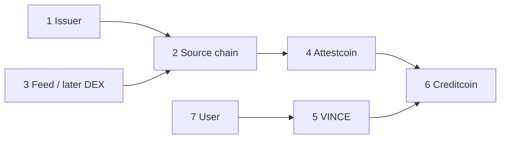

# 03 — Ecosystem

VINCE has seven parties. Document them so no layer silently absorbs another party's job.



## Party 1 — Tokenized-stock issuer

Third party. VINCE does not control:

```text
AAPLc  AMZNc  COINc  CRCLc  GOOGLc  INTCc
METAc  MSFTc  MSTRc  NVDAc  SNDKc  SPCXc  TSLAc
```

These are Coinbase-issued B20 tokens on Base. VINCE treats them as external assets.

Issuer-controlled properties VINCE must not ignore:

- multiplier (corporate actions; 1 token is not permanently 1 share)
- pause of specific functions
- transfer policies / allow-block lists
- mutable `name` and `symbol`
- mint/redeem restricted to Authorized Participants

VINCE must not modify these contracts. They are native B20 precompiles, not ordinary independently verified Solidity tokens.

## Party 2 — Source chain (MVP: Ethereum)

MVP source is Ethereum Mainnet (`chainKey` 3 on CC3 Testnet). The user pastes a Chainlink feed-update.

Base is the intended later source for B20 tokenized stocks. Attestcoin's published environment tables and live `getSupportedChains()` list Ethereum Mainnet and Ethereum Sepolia, **not** Base. Product `PASS` does **not** require Base ([ADR-005](./decisions/ADR-005-source-chain-feasibility.md)). Never fake a Base proof.

## Party 3 — DEX / liquidity venue

Provides the **approved secondary-market venue**, for example `TSLAc / USDC`.

VINCE does not accept arbitrary pools. The venue is protocol configuration ([ADR-002](./decisions/ADR-002-approved-market.md)).

MVP **price** is not this venue. Price is the Coinbase Chainlink total-return feed ([ADR-003](./decisions/ADR-003-price-observation-model.md)). Those feeds are **not** DEX prices and do not run 24/7.

## Party 4 — Attestcoin

Verification infrastructure hosted on Creditcoin.

Its role is not:

> TSLAc is worth $250.

Its role is:

> This source-chain transaction is cryptographically verified as belonging to the attested source chain.

Mechanics, from official docs:

- attestors reach consensus on source-chain blocks
- Proof Builder produces a Merkle proof (tx in block) and a continuity proof (block anchored to attestation)
- Block Prover precompile verifies both at `0x0FD2`
- verification is synchronous
- inclusion is not success; dApps must check receipt status `0x1`

## Party 5 — VINCE

The decision layer.

VINCE decides:

```text
Is this the correct asset address?
Is this the approved market?
Is the observation fresh?
Is liquidity sufficient?
Does price satisfy threshold?
Is the proof valid?
Did the source transaction succeed?
```

VINCE is not the issuer, not the DEX, not Attestcoin, and not Creditcoin itself.

## Party 6 — Creditcoin

Execution and settlement environment.

VINCE contracts ultimately say:

```text
PASS window
REJECT
releaseFinancing
```

Lab vault may also LOCK / UNLOCK / BORROW. That is not the product UI.

Creditcoin hosts Attestcoin precompiles and VINCE ASCs. Live app chain is Creditcoin Testnet `102031` ([ADR-014](./decisions/ADR-014-creditcoin-settlement.md)).

## Party 7 — User

Interacts through the VINCE UI.

The user cares about the condition and whether the desk can continue. They do not need to operate a prover. They **do** paste a source tx hash ([ADR-010](./decisions/ADR-010-user-pastes-tx.md)). Connect Creditcoin only to submit proofs and to use the desk.

The user is untrusted. A user-supplied transaction hash is a candidate, not a fact.

## Who is allowed to do what

| Action | Issuer | Base | DEX | Attestcoin | VINCE | Creditcoin | User / worker |
| --- | --- | --- | --- | --- | --- | --- | --- |
| Define B20 token | Yes | Hosts | No | No | No | No | No |
| Create a market price print | No | Hosts Chainlink feed | DEX print exists; not MVP price | No | Consumes proven feed round | Hosts | Prepares proof |
| Prove tx inclusion | No | No | No | Yes | Consumes | Hosts precompile | Prepares proof |
| Interpret financial policy | No | No | No | No | Yes | Executes | No |
| Move desk / vault funds | No | No | No | No | Rules | State | Requests |

## Related

- Base integration: [integration/base.md](./integration/base.md)
- Attestcoin integration: [integration/attestcoin.md](./integration/attestcoin.md)
- Creditcoin integration: [integration/creditcoin.md](./integration/creditcoin.md)
