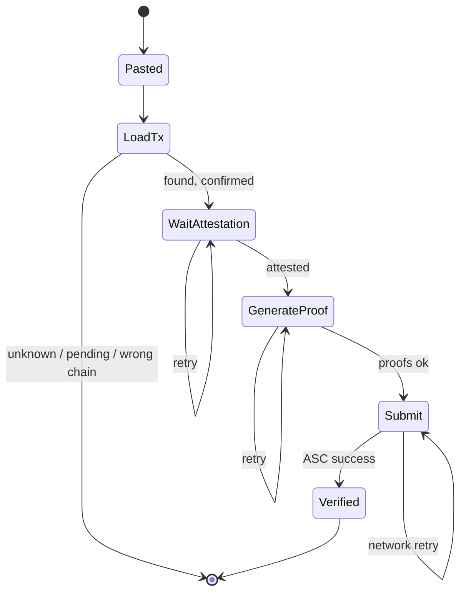

# Evidence worker

Implemented as `POST /api/observe` in `web/`. It generates Merkle + continuity proofs and calls `verifySingle` as a **preview**. On-chain `verifyAndEmit` happens when the user submits to `VinceGate` on Creditcoin Testnet. The worker never rewrites the pasted hash.

Primary UX: **user pastes a tx hash** ([ADR-010](../decisions/ADR-010-user-pastes-tx.md)).

## Job

```text
accept pasted tx hash
        ↓
load tx on Ethereum RPC
        ↓
wait for that block to be attested
        ↓
fetch Merkle + continuity proofs
        ↓
verifySingle (view, fail closed)
        ↓
return preview to UI  (user submits to VinceGate)
```

## Non-jobs

- Deciding PASS/REJECT
- Writing prices on-chain
- Skipping proofs
- Silently picking a "good" swap
- Relabeling Ethereum as Base

## Stage machine



## Modes

| Mode | Source | UI label | May PASS the MVP market? |
| --- | --- | --- | --- |
| `market` | Ethereum Mainnet (`chainKey` 3 on CC3 Testnet) | Verified on Ethereum | Yes, if policy passes |
| `smoke` | Ethereum Sepolia (`chainKey` 1) | Verified on Sepolia (smoke) | Only the smoke market, never labeled TSLA/Base |
| `base-later` | Base, if `getSupportedChains` lists it | Verified on Base | Later ADR, not MVP |

## Fail closed

If the worker cannot prove the **pasted** hash, it returns a structured error. It does not swap in another tx.
