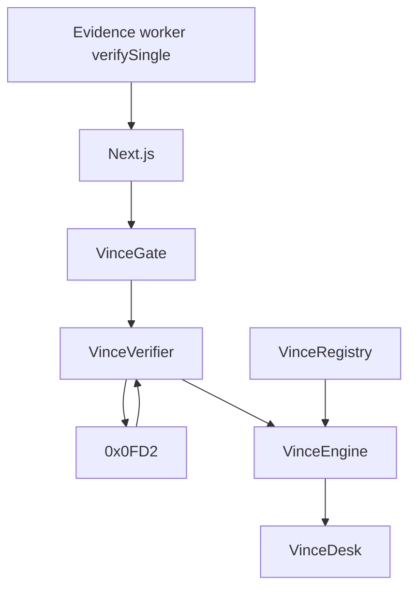

# Contract architecture

VINCE contracts live on **Creditcoin Testnet**. They are Attestcoin Smart Contracts (ASCs) plus business logic.

Live addresses: [`../../contracts/deployments/creditcoin-testnet.json`](../../contracts/deployments/creditcoin-testnet.json) and the root [README.md](../../README.md).

## Pattern: separated

Attestcoin allows combined or separated. VINCE uses **separated**.

```text
VinceVerifier     ASC: proofs → 0x0FD2 verifyAndEmit → receipt 0x1
        ↓
VinceEngine       decode AnswerUpdated + registry policy + PASS window
        ↓
VinceGate         user submit of Merkle + continuity + encoded tx
VinceDesk         releaseFinancing only while inWindow
VinceRegistry     owner list / unlist / pause
VinceVault        lab only — not in the UI
```



## Live Creditcoin Testnet (`102031`)

Deployed 2026-09-11 from `0x10Ede187d03D651fc68f62a2d6501F67A6e93a86`. Registry starts empty.

| Contract | Address |
| --- | --- |
| VinceRegistry | `0x8C4D6fDe62399ffAC59f94748aD7971d146D7C85` |
| VinceVerifier | `0xE40049B2907F5e3a64892cEB87E46D0bd04b6cE9` |
| VinceEngine | `0x51Ce2eEb608067E3Ecff94BEcaB4B2449e66B7Fe` |
| VinceGate | `0xe108bBF7Da6b2E6df81a3e4654F163590ea5121E` |
| VinceDesk | `0x6C0bfD0afFf3ACf3C4d395f22fb4cff16aC1620e` |
| Block Prover | `0x0000000000000000000000000000000000000FD2` |
| EvmV1Decoder | `0x731c345d79Fb8BbDC541f9DF3b6317585F849F9f` |

## Creditcoin / Attestcoin primitives VINCE calls

| Primitive | Address | Role |
| --- | --- | --- |
| Block Prover | `0x0000000000000000000000000000000000000FD2` | `verify` / `verifyAndEmit` |
| ChainInfo | `0x0000000000000000000000000000000000000FD3` | supported chains, attestations |
| EvmV1Decoder | CC3 Testnet `0x731c345d79Fb8BbDC541f9DF3b6317585F849F9f` | decode proven tx bytes |

Do not invent `0x0FD2` on Sepolia. The superseded Sepolia lab (ADR-012) cannot re-check the precompile.

## Replay protection

Key from `chainKey`, `blockHeight`, and transaction index derived from the Merkle path. Store `processedQueries[txKey]`. Replays revert.

## Tooling

- Solidity `0.8.24`
- Hardhat + TypeScript
- OpenZeppelin only for mundane pieces (Ownable, ERC20 mock), not for verification

## What is not a VINCE contract

- B20 tokens
- DEX pools
- Attestcoin attestor software
- The Block Prover itself

## Deployment order

1. Registry (empty)
2. Verifier
3. Engine
4. Gate + `engine.setGate`
5. Desk
6. Vault last (lab)

Do not auto-list a feed.

## Related

- [interfaces.md](./interfaces.md)
- [security-model.md](./security-model.md)
- [../integration/creditcoin.md](../integration/creditcoin.md)
- [../decisions/ADR-014-creditcoin-settlement.md](../decisions/ADR-014-creditcoin-settlement.md)
