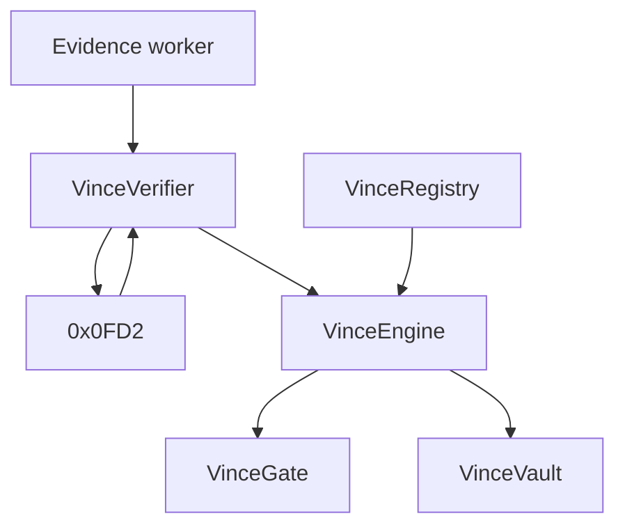

# Contract architecture

VINCE contracts live on Creditcoin. They are Attestcoin Smart Contracts (ASCs) plus business logic.

## Pattern: separated

Attestcoin allows combined or separated. VINCE uses **separated**.

```text
VinceVerifier          ASC: proofs → precompile → verified bytes
        ↓
VinceNormalizer        decode + structural checks
        ↓
VincePolicy            registry rules
        ↓
VinceDecision          PASS / REJECT
        ↓
VinceGate / VinceVault execution
VinceRegistry          config
```

Names are conceptual. Implementation may merge Normalizer, Policy, and Decision into one `VinceEngine` if the surface stays small, but Verifier must stay distinct from Vault.



## Creditcoin / Attestcoin primitives VINCE will call

| Primitive | Address | Role |
| --- | --- | --- |
| Block Prover | `0x0000000000000000000000000000000000000FD2` | `verify` / `verifyAndEmit` |
| ChainInfo | `0x0000000000000000000000000000000000000FD3` | supported chains, attestations |
| EvmV1Decoder | environment-specific | decode proven tx bytes |

Official decoder addresses:

| Network | Decoder |
| --- | --- |
| CC3 Mainnet | `0x9D094C9f22B10FCf842c2fC6A0981630A4F94B5C` |
| CC3 Testnet | `0x731c345d79Fb8BbDC541f9DF3b6317585F849F9f` |

Confirm on-chain before use. Do not copy decoder bytecode from blog posts.

## Replay protection

Follow Attestcoin's ASC pattern: key from `chainKey`, `blockHeight`, and transaction index derived from the Merkle path. Store `processedQueries[txKey]`.

Whether a processed query can still *inform* a later action is a policy question (ADR-004). It must not be mint-style double-spend.

## Tooling

- Solidity `^0.8.20` or newer as required by Attestcoin examples (`^0.8.23` appears in ASC samples)
- Hardhat + TypeScript, per Creditcoin docs
- OpenZeppelin only for mundane pieces (Ownable, ERC20 mock collateral), not for verification

## What is not a VINCE contract

- B20 tokens
- DEX pools
- Attestcoin attestor software
- The Block Prover itself

## Deployment order (when coding starts)

1. Registry (paused, empty)
2. Verifier
3. Engine
4. Gate
5. Vault last

## Related

- [interfaces.md](./interfaces.md)
- [security-model.md](./security-model.md)
- [../integration/creditcoin.md](../integration/creditcoin.md)
