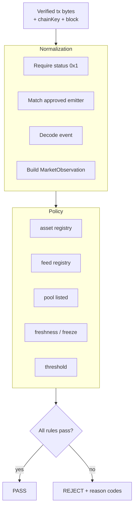

# Decision engine

The decision engine is the protocol. The desk is a client of it. The vault is a lab client.

## Pipeline

```text
verified tx bytes
        ↓
NORMALIZATION     MarketObservation
        ↓
POLICY            rule results
        ↓
DECISION          PASS | REJECT
        ↓
EXECUTION         gate window / desk
```



## Normalization

Turn verified bytes into a protocol object.

Must:

- reject failed source txs
- reject unknown event signatures
- reject emitters not in the registry
- reject asset addresses not in the registry
- decode Chainlink round `answer` at 8 decimals; do not apply multiplier again

Must not:

- take `observedPrice` as a function argument from the worker
- use block.timestamp on Creditcoin as the observation time

## Policy rules

Each rule is testable. A `REJECT` names every failed rule.

MVP candidate rules (parameters blank until Phase 4):

| Rule | Meaning |
| --- | --- |
| `SOURCE_CHAIN` | Proven `chainKey` is Attestcoin-supported and allowed for that listing |
| `FEED_APPROVED` | Log emitter matches **a** registered feed |
| `TX_SUCCESS` | Receipt status `0x1` |
| `FRESHNESS` | Round `updatedAt` within **that market's** `maxAge` |
| `FEED_FROZEN` | Reject if feed paused or `updatedAt` not advancing |
| `THRESHOLD` | `observedPrice` vs **that market's** `minimumPrice` |
| `LIQUIDITY` | Not required for MVP price PASS; Phase 7 |
| `PROOF_VALID` | Already required by verifier; still logged |

`maxAge`, `minimumPrice`, and liquidity bounds are registry config, not code constants.

## Decision

```text
PASS
REJECT
```

No third status on-chain. Off-chain UX may show `PENDING_ATTESTATION` or `PROOF_FAILED` before the engine is invoked.

Reason codes are stable strings, for example:

```text
REJECT_ASSET
REJECT_SOURCE_CHAIN
REJECT_FEED
REJECT_MARKET
REJECT_STALE
REJECT_FEED_FROZEN
REJECT_THRESHOLD
REJECT_LIQUIDITY
REJECT_STATUS
REJECT_DECODE
```

## Execution

The engine returns a decision. It does not move funds.

The gate or vault:

- reverts on `REJECT` for security-critical actions
- records the verified tx key
- emits an event the UI can display without trusting the API

## Separation from verification

If proofs are valid and threshold fails:

```text
[Proof]         status=verified
[Decision]      decision=REJECT reason=REJECT_THRESHOLD
[Execution]     action=borrow status=REVERTED
```

That is success of the verification layer and failure of policy. Both are correct.

## Related

- [collateral-vault.md](./collateral-vault.md)
- [market-registry.md](./market-registry.md)
- [../contracts/interfaces.md](../contracts/interfaces.md)
