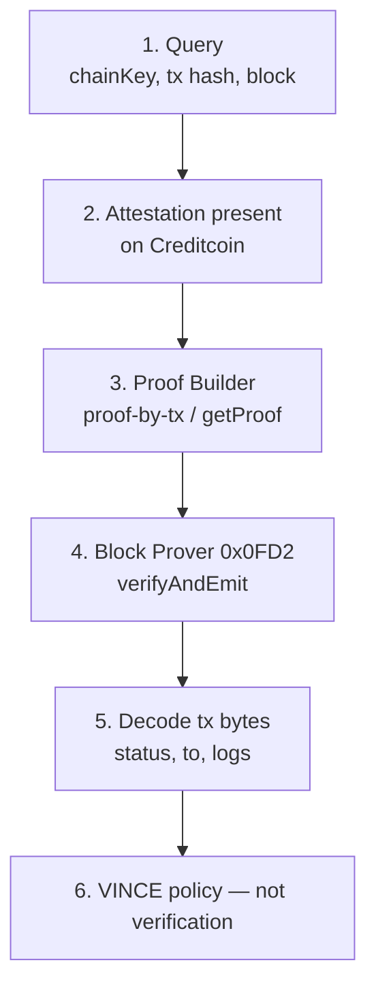

# Verification

VINCE uses Attestcoin **readability**, not writability, in MVP.

Writability (Creditcoin → other chains) is out of scope until an ADR says otherwise.

## What verification means

A transaction inclusion proof answers:

> Did this transaction really happen on chain X, in an attested block?

It is two proofs:

| Part | Proves |
| --- | --- |
| Merkle proof | The transaction is in that block's transaction tree |
| Continuity proof | That block is in a digest chain anchored to an attestation or checkpoint on Creditcoin |

Together they are verified by Creditcoin's Block Prover precompile at `0x0000000000000000000000000000000000000FD2`.

## What verification does not mean

- The transaction succeeded. Check receipt status `0x1`.
- The logs are the logs VINCE cares about. Decode and match.
- The price is fair. That is policy.
- The chain is Base. That is `getSupportedChains()`.

## Official flow

From Attestcoin Step 2 and the SDK:

```text
1. Identify target tx          Query
2. Wait for attestation        waitUntilHeightAttested
3. Build Merkle + continuity   ProofBuilder.getProof
4. Verify on Creditcoin        verify / verifyAndEmit
5. Extract bytes               EvmV1Decoder or equivalent
```



SDK components:

- `PrecompileChainInfoProvider` — supported chains, attestation, continuity bounds
- `ProofBuilder` — hosted proof API (default)
- `RawProofBuilder` — local computation, only if ADR-authorized
- `PrecompileBlockProver` — `verifySingle` / `verifyBatch`

## Continuity, short version

A continuity proof links `queryHeight` to an attestation/checkpoint:

```text
digest[i] = hash(blockNumber[i], merkleRoot[i], digest[i-1])
```

Structure:

```text
ContinuityProof {
  lowerEndpointDigest   // digest of queryHeight - 1
  roots[]               // merkle roots from queryHeight to attestation
}
```

If any block is swapped, digests cascade and the final digest will not match the on-chain attestation.

Ethereum attestation cadence in Attestcoin docs: attestations about every two minutes, checkpoints about every twenty minutes. **Do not assume Base has the same cadence until measured.**

## Merkle, short version

Standard Keccak-256 Merkle tree over transactions in the block. Proof is sibling hashes plus left/right position. Precompile reconstructs the root.

## Batch proofs

SDK documents:

- `MAX_BATCH_SIZE` = 10
- `MAX_BATCH_RANGE` = 1000 blocks
- One shared continuity proof

Useful for Phase 7 TWAP-like observations. Not required for Phase 5.

## VINCE verifier adapter duties

On-chain, after `verifyAndEmit` returns true:

1. Compute a tx key from `chainKey`, `blockHeight`, and transaction index.
2. Reject if already processed, unless policy explicitly allows reuse.
3. Decode transaction type; reject unsupported types.
4. Require `receiptStatus == 1`.
5. Pass verified bytes to normalization. Stop. Do not evaluate price here.

## Failure modes

| Failure | Stage | User-facing class |
| --- | --- | --- |
| Chain not supported | Query | verification unavailable |
| Block not yet attested | Wait | waiting |
| Proof builder error | Generation | proof generation failed |
| Precompile returns false / reverts | Verification | proof verification failed |
| Receipt status ≠ 1 | Extraction | source transaction failed |
| Decode mismatch | Normalization | invalid observation |

Never label these as "market condition not met". That message is only for policy `REJECT` after verification succeeded.

## Sources

- https://docs.attestcoin.org/attestcoin-protocol/architecture
- https://docs.attestcoin.org/attestcoin-protocol/attestcoin-readability/step-2-transaction-proving
- https://docs.attestcoin.org/attestcoin-protocol/attestcoin-readability/step-2-transaction-proving/merkle-proving-and-transaction-inclusion
- https://docs.attestcoin.org/attestcoin-protocol/attestcoin-readability/step-2-transaction-proving/continuity-proving-for-queries
- https://docs.attestcoin.org/attestcoin-protocol/dapp-builder-infrastructure/attestcoin-sdk-usc-sdk
