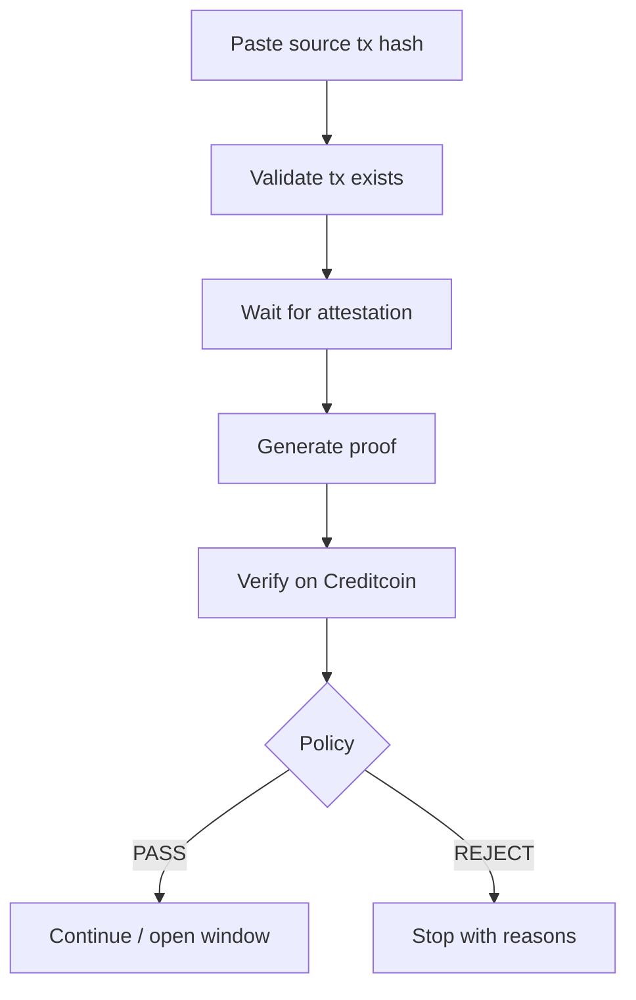

# User flows

The product is a **paste-a-tx verification gate**, then a vault that consumes a 30-minute PASS window. Users should not operate Attestcoin, but they **do** paste a source tx hash.

First-visit clicks, copy, and “where do I get a tx” live in [onboarding.md](./onboarding.md).

## Flow 0 — Land, then paste

```text
/  Open the gate
        ↓
/gate  paste hash  (wallet still optional)
        ↓
two verdicts
        ↓
PASS → Continue to vault (now connect Creditcoin)
REJECT → stay; do not silently swap the hash
```

## Flow A — Verified Market Gate (MVP core)



User-visible steps:

```text
Paste transaction hash
        ↓
Validating source transaction...
        ↓
Waiting for source block attestation...
        ↓
Generating proof...
        ↓
Verifying on Creditcoin...
        ↓
✓ Proof verified
        ↓
Market condition satisfied
        ↓
[Continue]
```

This flow **is** the application. Everything else is a consumer of it.

## Flow B — Vault (same verification)

```text
Deposit vUSD
        ↓
Paste feed-update tx (or reuse live window)
        ↓
PASS window 30 minutes
        ↓
borrowLimit = collateral * 50%
        ↓
Window expired → borrow reverts until a newer tx is verified
```

## Flow C — Bad paste (must be distinct in UI)

| Paste | Proof | Decision |
| --- | --- | --- |
| Listed BAT feed-update, fresh, above BAT floor | success | PASS |
| Unlisted GOOGL/SPCX feed-update | success | REJECT_FEED (still show decoded name) |
| Listed feed, stale | success | REJECT_STALE |
| Random Uniswap tx on Ethereum | success | REJECT_FEED |
| Base TSLAc swap | fail or REJECT_SOURCE_CHAIN | not "Verified on Base" |
| Wallet address (40 hex) | no proof | not a transaction |
| Garbage hash | no proof | invalid tx |

## What the user never does

- Call Proof Builder
- Pack Merkle siblings
- Read a continuity digest

They **do** paste the hash. That is intentional ([ADR-010](../decisions/ADR-010-user-pastes-tx.md)).

## Related

- [onboarding.md](./onboarding.md)
- [verification-flow.md](./verification-flow.md)
- [error-states.md](./error-states.md)
- [../application/frontend.md](../application/frontend.md)
